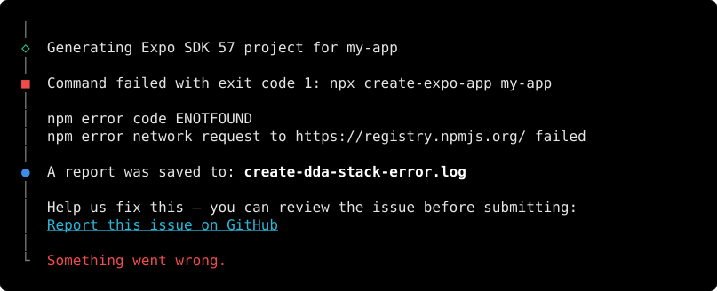

<p align="center">
  
</p>

# create-dda-stack

Create a ready-to-code React Native app in one command.

## Quick start

```bash
npx create-dda-stack@latest
```

Answer a few questions and your app is ready. Works with npm, yarn, pnpm and bun.

## Pick a stack

| Stack | Best for |
| --- | --- |
| **Expo** | Starting fast. Pick Expo Router (file-based) or React Navigation |
| **React Native CLI** | Full native control |
| **Superapp** | A host app that loads sub-apps (Re.Pack + Module Federation) |

## What you get

Every app comes with:

- **Navigation** with bottom tabs (Home + Explore)
- **React Query** for data fetching
- **Axios** client with auth token handling
- **`.env`** config with types
- **ESLint + Prettier**, ready to run with `npm run lint`

You can also add:

- **State management**: Zustand or Redux Toolkit
- **NativeWind**: Tailwind CSS for React Native
- **Reactotron**: a desktop debugger

## Skip the questions

Pass flags to set up everything in one line:

```bash
npx create-dda-stack@latest my-app --stack expo --state zustand --pm pnpm --yes
```

| Flag | Options |
| --- | --- |
| `--stack` | `expo`, `rn-cli`, `superapp` |
| `--state` | `none`, `zustand`, `redux-toolkit` |
| `--pm` | `npm`, `yarn`, `pnpm`, `bun` |
| `--router` | `expo-router`, `react-navigation` (Expo only) |
| `--nativewind` | Add NativeWind |
| `--reactotron` | Add Reactotron |
| `--no-install` | Skip installing dependencies |
| `--yes` | Use defaults for anything not set |

See `npx create-dda-stack --help` for all flags, including version pinning.

## Add a mini-app to a superapp

Run this inside your host app (or the folder that contains it):

```bash
npx create-dda-stack@latest add-miniapp payments --title Payments --icon 💳
```

This creates a new sub-app next to the host and adds a new bottom tab for it in the host. The sub-app uses the same React Native, Re.Pack, state library and package manager as the host, and gets the next free dev port.

Then start the new sub-app and restart the host's dev server:

```bash
cd ../my-app-payments && npm start   # serves the new mini-app

# in the host's terminal: stop the dev server (Ctrl+C), then
npm start -- --reset-cache
```

> [!IMPORTANT]
> **Restart the host's dev server after adding a mini-app.** The host only reads its list of mini-apps when the dev server starts. If it was already running, the new tab shows `Cannot find module 'payments/HomeScreen'` until you restart it. Reloading the app isn't enough, but you don't need to rebuild it with `npm run ios` either.

Each mini-app is one entry in the host's `miniapps.json`. Edit that file to change a tab's title or icon, or to set `prodUrl`: the address that serves `<platform>/mf-manifest.json` in release builds. Restart the host's dev server after a change.

If a mini-app uses a native module, install it in the host too and run `pod install` there. Sub-apps can't ship native code to the host.

See `npx create-dda-stack add-miniapp --help` for all flags.

## Requirements

Node.js 18 or newer.

## Report an issue

If something goes wrong, the CLI saves the details to `create-dda-stack-error.log` and prints a link to a pre-filled GitHub issue. Nothing is sent automatically — you review the issue and choose whether to submit it.

<p align="center">
  
</p>

## Contributing

```bash
pnpm install
pnpm dev     # run from source
pnpm build
```

## License

MIT
